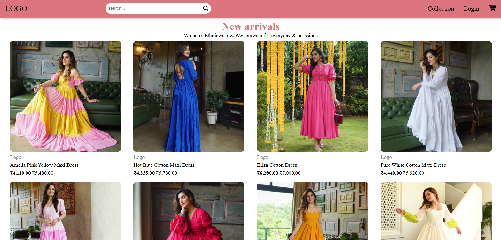
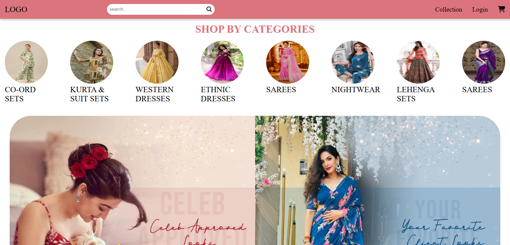
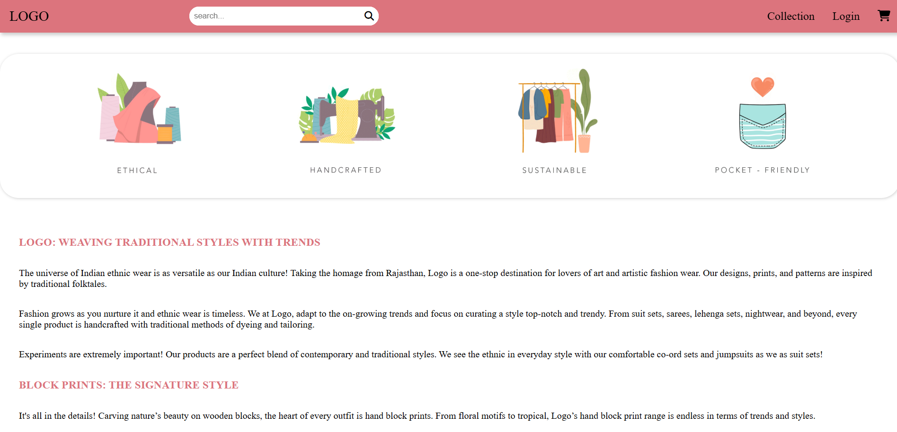
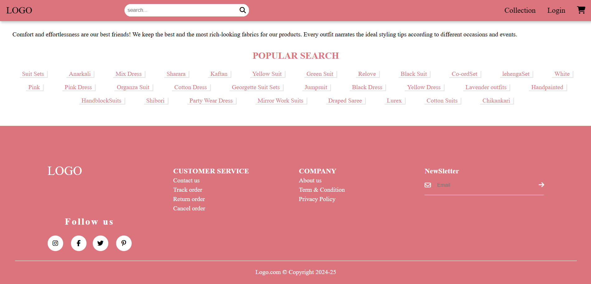

# BunaaiClone 🌸

A beautiful **fashion e-commerce front-end website** showcasing ethnic wear for women. This project is a static clone of Bunaai.com, featuring a wide collection of dresses, kurta sets, and lehengas with a modern user interface using **HTML, CSS, and FontAwesome**.

---

## 📸 Screenshot







---

## ✨ Features

- 🔍 Responsive navigation bar with search bar
- 🖼️ Hero section banner with call-to-action
- 👗 Product galleries categorized as:
  - **New Arrivals**
  - **Kurta & Suit Sets**
  - **Lehenga Sets**
- 🎠 Category slider: Shop by Categories (Sarees, Nightwear, Co-ord Sets, etc.)
- 📜 About section with detailed content and brand philosophy
- 🔁 “Show More” buttons for product expansion
- 📌 Footer with newsletter, links, and social icons
- ⭐ GIF-based quality assurance visuals

---

## 🛠️ Technologies Used

- **HTML5**
- **CSS3**
- **FontAwesome** (Icons)
- **Responsive Web Design**

---

## 🧾 Project Structure

```
/project-root
│
├── index.html
├── index.css
├── images/
│   ├── hero_black_img.webp
│   ├── dress-product-1.webp ... dress-product-8.webp
│   ├── kurta-product-1.webp ... kurta-product-8.webp
│   ├── lehenga-product-1.webp ... lehenga-product-8.webp
│   ├── slide-img-1.jpg ... slide-img-8.jpg
│   ├── celebs.webp, client_1.webp
│   └── quality1.gif ... quality4.gif
```

---

## 📩 Contact

- Developer: Preetam Kumawat  
- Email: preetamkumawat002@gmail.com  
- LinkedIn: linkedin.com/in/kumawatpreetam  
- GitHub: github.com/kumawatpreetam

---

## 📄 License

This project is for educational purposes only. Images and content are used for learning and design practice.
